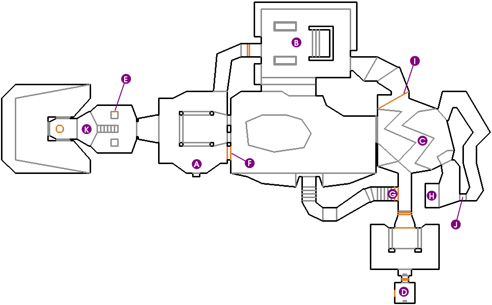

# DoomMe

 
<strong>Click to Play DOOM</strong>

---

## **Overview**
**DoomMe** is an experimental "spectator mode" exploration of the classic **Doom (1993)** E1M1 map, rendered entirely within GitHub's markdown viewer. 

It is **not** a playable version of Doom. Instead, it is a static traversal of the level's geometry, pre-rendered and interlinked to allow you to "walk" through the map by clicking directional buttons. Think of it as a museum tour of the E1M1 level design.

 
<em>Map layout of E1M1 (Hangar) - The area covered by this project.</em>

## **How It Works**
The "engine" you are interacting with is purely illusory. There is no JavaScript, no WASM, and no server-side logic. Every possible view and movement is pre-calculated.

### **1. The Map Extraction (Omgifol)**
The biggest challenge was accurately mapping the playable area. 
- **Initial Failure (BFS)**: My first attempt used a "Blind Walk" algorithm (Breadth-First Search) where an agent would bump into walls to find paths. This failed to discover disconnected rooms or areas behind doors.
- **The Solution**: I switched to **[Omgifol](https://github.com/devinacker/omgifol)**, a Python library that parses the original `doom1.wad` file.
    - We extract the **Linedefs** and **Sectors**.
    - We filter for sectors with a floor height > 50 (playable space).
    - We use a **Point-in-Polygon** ray-casting algorithm to generate a grid of valid coordinates every 64 units.

### **2. The Capture (VizDoom)**
Once the grid was established (resulting in ~1,085 valid nodes), I used **[VizDoom](http://vizdoom.cs.put.poznan.pl/)** to capture the visuals.
- The agent is "teleported" to each coordinate.
- It rotates to 4 cardinal directions (North, South, East, West).
- A screenshot is saved for every single state.
- **Result**: ~4,340 snapshots of the map.

### **3. The Graph (Linker)**
The `linker.py` script ties it all together into a massive graph.
- **Nodes**: `(x, y, angle)`
- **Edges**:
    - **Move**: `(x, y)` -> `(x ± 64, y ± 64)` details.
    - **Polishing**: I utilized 8-way movement logic, allowing for strafing (diagonal moves) which keeps the camera angle fixed but changes position.

## **Technical Roadblocks & Choices**
1.  **File Count vs. Git**: Storing 4,000+ files is heavy. I had to use `WebP` compression (85% quality) to keep the repo size manageable while maintaining visual fidelity.
2.  **Grid Quantization**: Doom is continuous, but this project is discrete. The **64-unit** step size was chosen because it matches Doom's floor texture alignment (64x64 pixels). This makes the movement feel "on the beat" of the level geometry.
3.  **Turning**: I limited turning to 90° increments. 45° turns would have doubled the file count to ~8,600 images, which was deemed too large for a single "fun" commit.

### **Controls**
- **⬆️ / ⬇️**: Move Forward / Backward
- **⬅️ / ➡️**: Turn 90° Left/Right AND Move
- **↖️ / ↗️ / ↙️ / ↘️**: Strafe (Move diagonally while facing same direction)

*(Click the top image to start your tour)*
